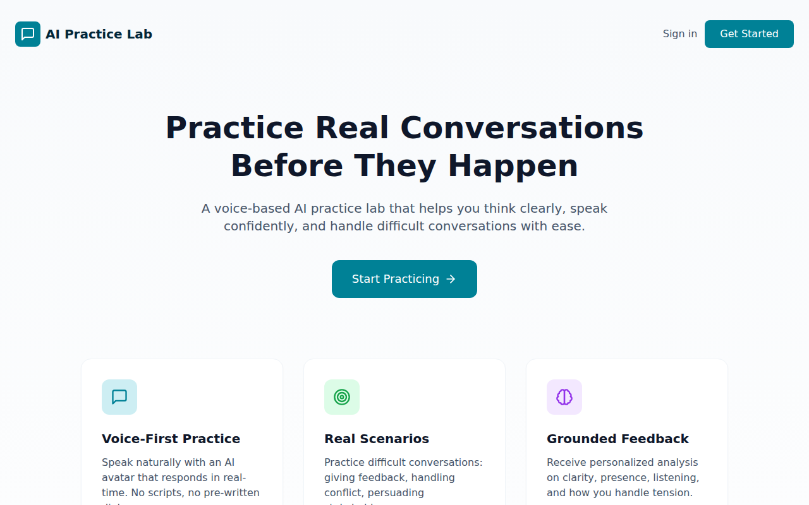
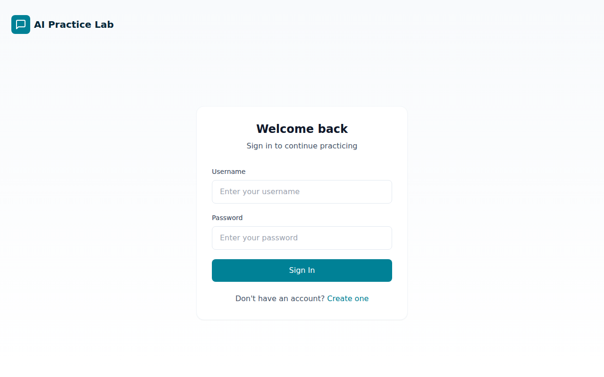
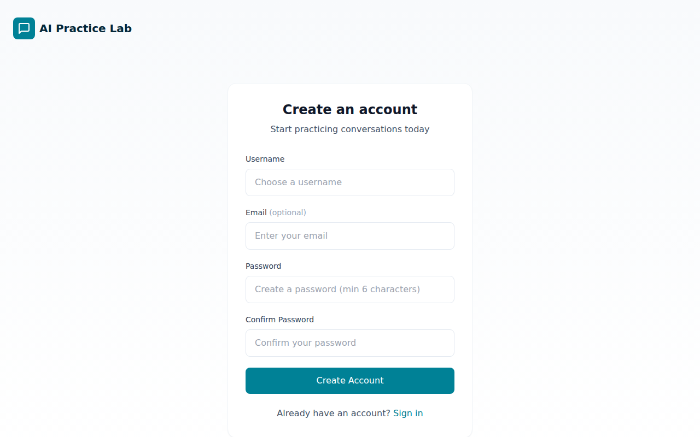
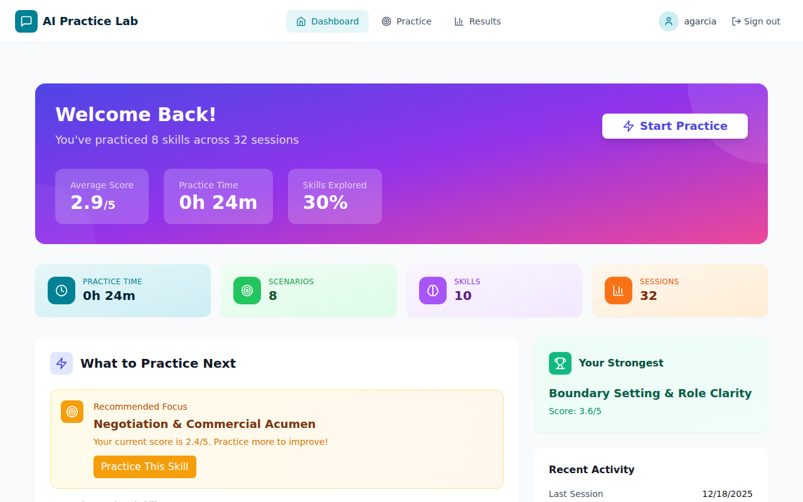
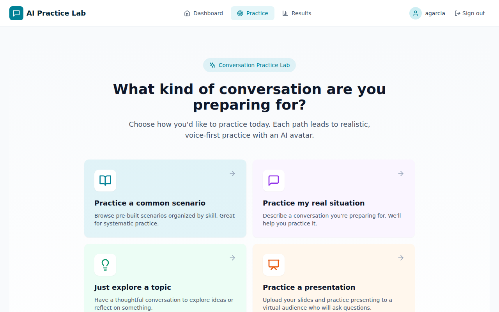
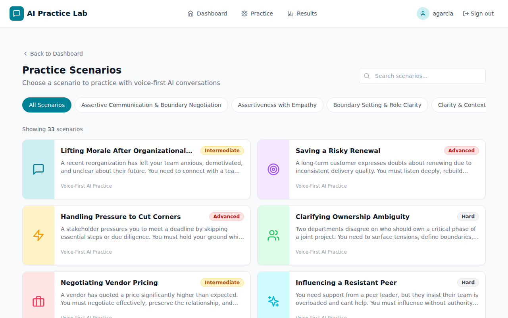
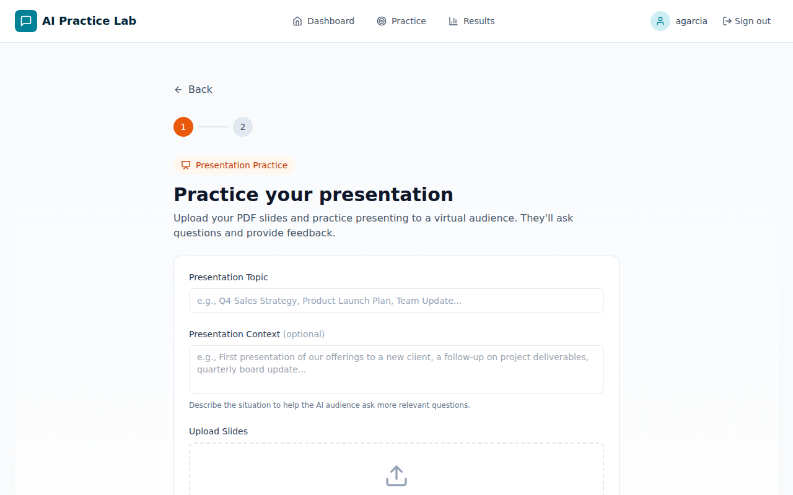
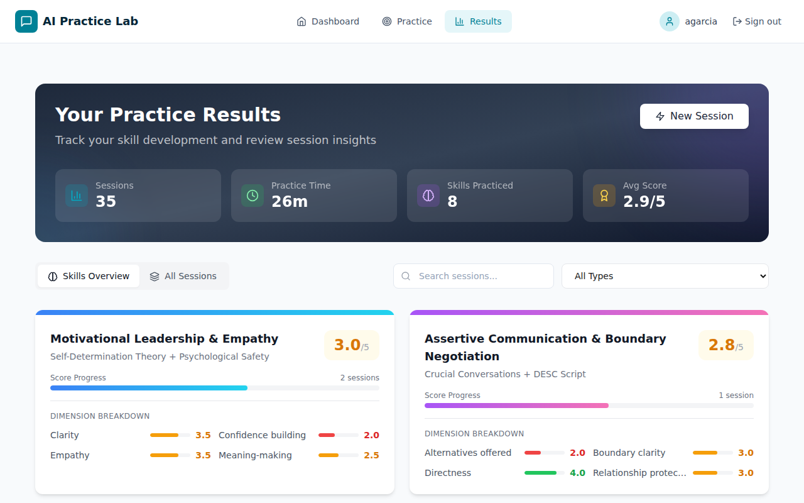

# Avatar Practice Lab - Product Documentation

## Visual Guide - Application Pages

### 1. Home Page (`/`)
**Purpose:** Landing page introducing the platform



**Visual Elements:**
- Header with "AI Practice Lab" logo and navigation (Sign in, Get Started buttons)
- Hero section with headline: "Practice Real Conversations Before They Happen"
- Subheadline: "A voice-based AI practice lab that helps you think clearly, speak confidently, and handle difficult conversations with ease."
- Teal "Start Practicing" call-to-action button
- Three feature cards at bottom: Voice-First Practice, Real Scenarios, Grounded Feedback

---

### 2. Login Page (`/login`)
**Purpose:** User authentication



**Visual Elements:**
- Clean, centered card layout
- "Welcome back" heading with username and password fields
- Teal "Sign In" button
- "Don't have an account? Create one" link

---

### 3. Register Page (`/register`)
**Purpose:** New user account creation



**Visual Elements:**
- "Create an account" heading
- Form fields: Username, Email (optional), Password, Confirm Password
- Teal "Create Account" button
- "Already have an account? Sign in" link

---

### 4. Dashboard (`/avatar/dashboard`)
**Purpose:** Main user hub showing progress and recommendations



**Visual Elements:**
- Top navigation: Dashboard, Practice, Results tabs
- Purple gradient hero banner with key metrics (Average Score, Practice Time, Skills Explored)
- Four stat cards: Practice Time, Scenarios, Skills, Sessions
- "What to Practice Next" section with AI-recommended focus areas
- "Your Strongest" skill card

---

### 5. Intent Entry / Start Page (`/avatar/start`)
**Purpose:** Entry point for starting a practice session



**Visual Elements:**
- Practice mode selection options
- Quick start paths for different practice types
- Navigation to scenarios or custom practice

---

### 6. Practice Selection (`/avatar/practice`)
**Purpose:** Browse and select practice scenarios



**Visual Elements:**
- Skill category filter sidebar
- Scenario cards grid with images, titles, descriptions
- Difficulty indicators and skill tags
- Search functionality

---

### 7. Presentation Practice (`/avatar/practice/presentation`)
**Purpose:** Upload PDF presentations for practice



**Visual Elements:**
- Step indicator (Upload, Preview)
- Orange "Presentation Practice" badge
- Presentation Topic and Context input fields
- PDF upload dropzone with drag-and-drop support
- "Virtual Audience Experience" info box

---

### 8. Results History (`/avatar/results`)
**Purpose:** View all past practice sessions



**Visual Elements:**
- Session list with date, scenario, and score
- Filter and search options
- Skills overview toggle
- Click-through to detailed analysis

---

### Additional Pages (Login Required)

#### Avatar Selection (`/avatar/practice/avatar-select`)
- Grid of avatar options with photos
- Avatar details (name, characteristics)
- Selection highlight and Continue button

#### Pre-Session Setup (`/avatar/practice/pre-session`)
- Scenario summary card
- Persona, Tone, and Language selectors
- "Start Session" button

#### Practice Session (`/avatar/practice/session`)
- Full-screen avatar video
- Session timer countdown
- Microphone controls and End session button

#### Session Analysis (`/avatar/session-analysis`)
- Overall score display
- Talk time distribution chart
- Filler words count, Pacing analysis
- Strengths and growth areas
- Full transcript accordion

---

## Executive Summary

Avatar Practice Lab is a **voice-first AI conversation practice platform** designed to help professionals practice real-life workplace conversations with realistic AI avatars. The platform provides a safe, judgment-free environment where users can improve their communication skills by engaging in realistic practice scenarios before facing them in real life.

---

## Table of Contents

1. [Product Vision](#product-vision)
2. [Core Features](#core-features)
3. [User Journey](#user-journey)
4. [Feature Deep Dive](#feature-deep-dive)
5. [Technical Architecture](#technical-architecture)
6. [Database Schema](#database-schema)
7. [API Reference](#api-reference)
8. [Third-Party Integrations](#third-party-integrations)
9. [Current Limitations](#current-limitations)
10. [Potential Enhancements](#potential-enhancements)

---

## Product Vision

### Problem Statement
Professionals often struggle with difficult workplace conversations - whether it's asking for a raise, delivering feedback, handling conflicts, or making presentations. Traditional training methods (role-playing with colleagues, reading guides) don't provide the realistic, pressure-free practice environment needed to build genuine confidence.

### Solution
Avatar Practice Lab uses cutting-edge AI technology to create a realistic conversation partner that:
- Responds naturally to voice input in real-time
- Adapts its persona and tone based on the scenario
- Provides actionable feedback on communication patterns after each session

### Target Users
- **Corporate Employees**: Practicing difficult conversations with managers/reports
- **Sales Professionals**: Rehearsing client pitches and objection handling
- **HR Professionals**: Preparing for sensitive employee discussions
- **Anyone seeking communication improvement**: Public speaking, interview prep, conflict resolution

---

## Core Features

### 1. Voice-First Practice
- **Natural Conversation**: Users speak naturally with an AI avatar that responds in real-time
- **No Scripts**: Genuine practice without pre-written dialogue
- **Multiple Languages**: Support for 22 languages including 8 Indian languages with code-mixing capabilities
- **Flag-Based Language Selection**: Redesigned voice input with visual language flags and auto-detection

### 2. Dual-Mode Avatar System
The platform offers two distinct practice modes:

| Mode | Technology | Best For |
|------|------------|----------|
| **Video Mode** | HeyGen Streaming Avatar SDK | Visual practice with photorealistic avatars, lip-sync |
| **Voice Mode** | OpenAI Realtime API + TTS | Faster, audio-focused practice sessions |

Both modes use the shared `buildFullScenarioPrompt()` function for prompt parity, ensuring consistent avatar behavior regardless of mode.

### 3. Realistic AI Avatars (HeyGen Integration)
- **Video Avatars**: Photorealistic streaming avatars with lip-sync and natural movements
- **Avatar Selection**: Users can choose from various avatars with different:
  - Appearances
  - Genders
  - Ethnicities
- **Avatar Customization**: Configure the avatar's behavior before each session

### 4. Scenario-Based Learning
- **Skill Categories**: Scenarios organized by communication skills
- **Pre-built Scenarios**: Ready-to-use workplace scenarios including:
  - Salary negotiations
  - Performance reviews
  - Conflict resolution
  - Client presentations
  - Difficult feedback delivery
- **Scenario Details**: Each scenario includes:
  - Context/background
  - Instructions for the user
  - Avatar role description
  - Difficulty level
  - Estimated duration

### 5. Session Customization
- **Persona Selection**: Choose how the avatar should behave (e.g., supportive, challenging, neutral)
- **Tone Selection**: Set the conversation tone (e.g., formal, casual, confrontational)
- **Language Selection**: Practice in 22 languages with strict enforcement - avatars speak only in the chosen language

### 6. Persona Overlay System
Role-based practice levels that adjust avatar behavior and feedback interpretation:

| Practice Level | Avatar Behavior | Expectations |
|----------------|-----------------|--------------|
| **IC/Junior** | More supportive, gentler pushback | Forgiving of minor mistakes |
| **Manager** | Moderate challenge, balanced feedback | Professional standards |
| **Director** | Higher expectations, strategic focus | Strong execution expected |
| **CXO** | Maximum challenge, executive presence | Exceptional performance required |

Each persona includes:
- Authority constraints and success criteria
- Common mistakes to watch for
- Tone guidance for realistic interactions
- Dynamic opening directives based on scenario mood

**Role-Level Auto-Mapping**: Users can type their job title (e.g., "Product Manager", "Software Engineer") and the system auto-detects the appropriate practice level using a dictionary of 77+ job titles with fuzzy matching.

### 7. Cultural Communication Style Presets
GlobeSmart-based presets that modify avatar behavior for intercultural practice:
- **Direct & Task-Focused**: Clear, efficient communication style
- **Indirect & Relationship-Focused**: Emphasis on rapport and context
- Additional regional communication patterns

### 8. AI-Powered Session Analysis
Post-session feedback includes:
- **Overall Score**: Numeric rating of session performance
- **Talk Time Analysis**: User vs. avatar speaking time distribution
- **Filler Words Detection**: Track usage of "um", "uh", "like", etc.
- **Weak Words Identification**: Words that undermine confidence
- **Sentence Openers Analysis**: How users begin their statements
- **Active Listening Metrics**: Engagement level, questions asked, acknowledgments
- **Pacing Analysis**: Speaking speed and variation
- **Tone Assessment**: Emotional tone throughout the conversation
- **Pause Analysis**: Count and average length of pauses
- **Strengths & Growth Areas**: Personalized recommendations
- **Follow-up Questions**: Suggested practice areas

### 9. Session Management
- **Queue System**: Manages concurrent sessions when at capacity
- **Session Timer**: 6-minute session limit with countdown display
- **Keep-Alive Mechanism**: Maintains session connectivity (heartbeat monitoring)
- **Pre-warming**: Reduces avatar startup latency by preparing sessions in advance
- **Voice Connection Optimization**: `RealtimeSessionPrewarmContext` pre-warms OpenAI Realtime tokens and Tavily research during avatar selection

### 10. Skill Framework Assessment
Uses OpenAI GPT-4o to evaluate transcripts against predefined skill dimensions:
- **Impromptu Communication**: Thinking on your feet
- **Effective Presentation**: Structure, clarity, engagement
- **TKI Conflict Styles**: Thomas-Kilmann Instrument assessment
- **GROW Coaching Framework**: Goal, Reality, Options, Will
- **Emotional Intelligence**: Self-awareness, empathy, regulation

### 11. Impromptu Speaking Mode
- **Auto-Categorization**: Topics automatically categorized by type
- **Category-Specific Styles**: Avatar conversation adapts to topic category
- **Real-Time Fact Enrichment**: Tavily Search API provides factual context
- **Anti-Hallucination Guardrails**: Avatars only use verified information

### 12. Presentation Practice
- **Document Upload**: Upload PDF presentations for practice
- **Skill-Based Assessment**: Structure, clarity, and visual design feedback
- **Language Selection**: 15 languages with strict enforcement
- **Virtual Audience Experience**: Practice presenting to AI audience

### 13. Progress Tracking Dashboard
- **Practice Statistics**: Total time, sessions completed, skills practiced
- **Skill Progress**: Track improvement across different skill areas
- **Session History**: Review past sessions and their analyses
- **Skill Breakdown**: Time spent on each skill category

### 14. Custom Scenarios
- **User Creation**: Users can create, save, and manage custom scenarios
- **AI Analysis**: AI analyzes custom scenarios for dynamic role generation
- **Automatic Skill Mapping**: Scenarios automatically mapped to relevant skills
- **Context & Objectives**: Define scenario context and success criteria

### 15. Admin Console (6-Page SaaS Dashboard)
Comprehensive admin interface at `/admin`:

| Page | Purpose |
|------|---------|
| **Analytics** | Platform-wide usage metrics and trends |
| **User Management** | User accounts, engagement tiers, activity |
| **Session Tracking** | Active/historical sessions, performance data |
| **Content Performance** | Scenario popularity, completion rates |
| **Avatar Usage** | Avatar selection patterns, usage statistics |
| **Cost Monitoring** | API costs, budget tracking, usage alerts |

**Admin Access**: Username: `admin`, Password: `admin123`

Additional admin capabilities:
- **Scenario Management**: Create, edit, and manage practice scenarios
- **Persona Management**: Configure available avatar personas
- **Tone Management**: Manage tone options for sessions
- **Session Cleanup**: Tools for managing stale sessions
- **Budget Guards**: Cost limits and usage thresholds

---

## User Journey

### Flow Diagram

```
┌─────────────────┐     ┌─────────────────┐     ┌─────────────────┐
│   Home Page     │────▶│    Dashboard    │────▶│ Select Skill    │
│  (Landing)      │     │  (Stats/Skills) │     │   Category      │
└─────────────────┘     └─────────────────┘     └─────────────────┘
                                                         │
                                                         ▼
┌─────────────────┐     ┌─────────────────┐     ┌─────────────────┐
│  Session        │◀────│  Pre-Session    │◀────│ Select Scenario │
│  (Practice)     │     │  (Customize)    │     │   Details       │
└─────────────────┘     └─────────────────┘     └─────────────────┘
         │                       ▲
         │              ┌────────┴────────┐
         ▼              │  Select Avatar  │
┌─────────────────┐     └─────────────────┘
│  Session        │
│  Analysis       │────▶ Return to Dashboard
└─────────────────┘
```

### Detailed User Flow

1. **Landing Page** (`/`)
   - Introduction to the platform
   - "Get Started" button leads to dashboard

2. **Dashboard** (`/avatar/dashboard`)
   - View practice statistics
   - See skill categories
   - Quick access to start practicing
   - View recent session history

3. **Practice Selection** (`/avatar/practice`)
   - Browse scenarios by skill
   - Filter and search capabilities
   - View scenario cards with key info

4. **Scenario Details** (`/avatar/practice/scenario-details`)
   - Full scenario description
   - Context and instructions
   - Avatar role explanation
   - Difficulty and duration info
   - Continue to avatar selection

5. **Avatar Selection** (`/avatar/practice/avatar-select`)
   - Browse available avatars
   - Filter by characteristics
   - Select preferred avatar
   - Pre-warming begins in background

6. **Pre-Session Setup** (`/avatar/practice/pre-session`)
   - Select persona (avatar behavior)
   - Select tone (conversation style)
   - Select language
   - Review scenario summary
   - Start session

7. **Practice Session** (`/avatar/practice/session`)
   - Real-time video avatar
   - Voice-based interaction
   - Session timer countdown
   - Queue status (if applicable)
   - End session button

8. **Session Analysis** (`/avatar/session-analysis`)
   - Comprehensive feedback
   - Metrics and scores
   - Transcript review
   - Strengths and growth areas
   - Return to practice or dashboard

9. **Results History** (`/avatar/results`)
   - View all past sessions
   - Search and filter sessions
   - Click to view detailed analysis

---

## Feature Deep Dive

### Interactive Avatar Component

The core of the practice experience is the `InteractiveAvatar` component which:
- Manages WebRTC connection to HeyGen streaming service
- Handles voice input/output
- Displays real-time avatar video
- Manages conversation state
- Captures transcript for analysis

### Session Timer System

- Sessions are limited to **6 minutes** (360 seconds)
- Visual countdown timer displayed during session
- Warning displayed when 1 minute remains
- Automatic session termination on expiry
- Heartbeat system to keep sessions alive

### Queue Management System

When all available session slots are in use:
- Users can join a queue
- Queue position is displayed
- Estimated wait time calculated
- Notification when slot becomes available
- 30-minute queue expiry

### Pre-warming System

To reduce avatar startup latency:
- Token is pre-fetched when user enters avatar selection
- Session preparation begins in background
- Reduces perceived wait time for users

---

## Technical Architecture

### Stack Overview

| Layer | Technology |
|-------|------------|
| **Frontend** | React 18, TypeScript, Vite |
| **Styling** | Tailwind CSS, Radix UI |
| **State Management** | React Query, React Context |
| **Routing** | React Router DOM v6 |
| **Backend** | Node.js, Express, TypeScript |
| **Database** | PostgreSQL (Neon Serverless) |
| **ORM** | Drizzle ORM |
| **File Storage** | AWS S3 |
| **Avatar Streaming** | HeyGen Streaming SDK |
| **AI/Voice** | OpenAI (GPT, Whisper, Realtime API) |

### Project Structure

```
avatar-practice-lab/
├── api/                          # Backend Express server
│   ├── routes/
│   │   └── avatar-simulator.ts   # Main API endpoints
│   ├── middleware/
│   │   └── auth.ts              # Authentication middleware
│   ├── utils/
│   │   ├── openai-client.ts     # OpenAI integration
│   │   └── s3.ts                # AWS S3 integration
│   ├── storage.ts               # Database operations
│   └── index.ts                 # Server entry point
├── ui/                          # React frontend
│   ├── pages/                   # Page components
│   │   ├── home/               # Landing page
│   │   ├── dashboard/          # User dashboard
│   │   ├── practice/           # Practice flow pages
│   │   ├── results/            # Session history
│   │   ├── session-analysis/   # Analysis view
│   │   └── admin/              # Admin pages
│   ├── components/              # Reusable components
│   │   ├── ui/                 # Design system components
│   │   ├── InteractiveAvatar.tsx
│   │   ├── SessionTimer.tsx
│   │   └── QueueStatusBanner.tsx
│   ├── contexts/                # React contexts
│   ├── hooks/                   # Custom hooks
│   └── lib/                     # Utilities and configs
├── shared/
│   └── schema.ts               # Database schema
└── database/
    ├── migrations/              # SQL migrations
    └── seeds/                   # Sample data
```

---

## Database Schema

### Core Tables

| Table | Purpose |
|-------|---------|
| `users` | User accounts and authentication |
| `skills` | Communication skill categories |
| `scenarios` | Practice scenarios with instructions |
| `personas` | Avatar behavior configurations |
| `tones` | Conversation tone options |
| `avatars` | Available avatar configurations |

### Session Tables

| Table | Purpose |
|-------|---------|
| `roleplay_session` | Individual practice sessions |
| `ai_sessions` | AI-powered session metadata |
| `transcripts` | Session transcript records |
| `transcript_messages` | Individual messages in transcripts |
| `ai_session_analysis` | Post-session analysis results |

### HeyGen Management Tables

| Table | Purpose |
|-------|---------|
| `heygen_sessions` | Track active HeyGen streaming sessions |
| `heygen_queue` | Manage waiting queue for sessions |

### Key Relationships

```
users ──┬── skills (created by)
        ├── scenarios (one skill → many scenarios)
        ├── roleplay_session (user sessions)
        ├── transcripts (session transcripts)
        └── heygen_sessions (active sessions)

scenarios ──── scenario_skills (many-to-many with skills)

heygen_sessions ──── heygen_queue (queue → assigned session)
```

---

## API Reference

### Scenario Endpoints

| Method | Endpoint | Description |
|--------|----------|-------------|
| GET | `/api/avatar/get-scenarios` | List all scenarios (filter by skill/role) |
| POST | `/api/avatar/save-scenario` | Create new scenario |
| POST | `/api/avatar/scenario` | Create scenario |
| PUT | `/api/avatar/scenario/:id` | Update scenario |
| GET | `/api/avatar/skills` | Get all skill categories |

### Session Endpoints

| Method | Endpoint | Description |
|--------|----------|-------------|
| POST | `/api/avatar/session/start` | Start tracked HeyGen session |
| GET | `/api/avatar/session/status` | Get session status and remaining time |
| POST | `/api/avatar/session/heartbeat` | Keep session alive |
| POST | `/api/avatar/session/end` | End session gracefully |
| GET | `/api/avatar/get-access-token` | Get HeyGen access token |

### Transcription & Analysis

| Method | Endpoint | Description |
|--------|----------|-------------|
| POST | `/api/avatar/transcribe` | Transcribe audio using Whisper |
| POST | `/api/avatar/analyze-session` | Generate session analysis |
| GET | `/api/avatar/session-analysis/:id` | Get analysis by ID |
| POST | `/api/avatar/save-transcript` | Save transcript messages |
| GET | `/api/avatar/get-transcript` | Get transcript by ID |
| GET | `/api/avatar/get-transcripts` | Get user's transcripts |

### Queue Management

| Method | Endpoint | Description |
|--------|----------|-------------|
| GET | `/api/avatar/session/availability` | Check session availability |
| POST | `/api/avatar/session/queue/join` | Join waiting queue |
| GET | `/api/avatar/session/queue/position` | Check queue position |
| POST | `/api/avatar/session/queue/leave` | Leave queue |
| POST | `/api/avatar/session/cleanup` | Admin cleanup of stale sessions |

### Configuration

| Method | Endpoint | Description |
|--------|----------|-------------|
| GET | `/api/avatar/personas` | List personas |
| POST | `/api/avatar/personas` | Create persona |
| PUT | `/api/avatar/personas/:id` | Update persona |
| GET | `/api/avatar/tones` | List tones |
| POST | `/api/avatar/tones` | Create tone |
| PUT | `/api/avatar/tones/:id` | Update tone |

---

## Third-Party Integrations

### HeyGen (Avatar Streaming)

- **Purpose**: Provides realistic, photorealistic AI avatars with real-time video streaming
- **SDK**: `@heygen/streaming-avatar`
- **Key Features Used**:
  - Streaming avatar video
  - Real-time lip sync
  - Voice interaction
- **Limitations**:
  - 6-minute session limit per streaming session
  - 100 concurrent session limit on paid plan
- **Cost Model**: Per-minute streaming charges

### OpenAI

- **Purpose**: Conversation AI and session analysis
- **APIs Used**:
  - **Whisper**: Audio transcription
  - **GPT-4**: Session analysis and feedback generation
  - **Realtime API**: Voice-based AI conversations
- **SDK**: `@openai/agents` for realtime voice

### AWS S3

- **Purpose**: Audio recording storage
- **Usage**: Store session audio recordings for later analysis/review

### Tavily Search API

- **Purpose**: Real-time fact research for impromptu conversations
- **Usage**: Provides factual context during impromptu speaking practice
- **Anti-Hallucination**: Ensures avatar responses are grounded in verified information

### Neon Database

- **Purpose**: PostgreSQL database hosting
- **Type**: Serverless PostgreSQL
- **SDK**: `@neondatabase/serverless`

---

## Current Limitations

### Technical Limitations

1. **Session Duration**: 6-minute maximum per HeyGen session
2. **Concurrent Sessions**: 100 maximum on paid HeyGen plan
3. **No Offline Mode**: Requires internet connection
4. **Browser Compatibility**: Best experience on Chrome/Edge (WebRTC requirements)

### Feature Limitations

1. **No Mobile App**: Web-only currently
2. **Limited Languages**: Primary support for English
3. **No Video Recording**: Sessions are audio-only for analysis
4. **Single User Sessions**: No multi-party practice scenarios

---

## Potential Enhancements

### Short-Term (Quick Wins)

1. **Session Recording Playback**: Allow users to replay their sessions
2. **Progress Charts**: Visualize improvement over time
3. **Scenario Favorites**: Save favorite scenarios for quick access
4. **Email Notifications**: Session reminders and progress reports
5. **Shareable Results**: Generate shareable practice summaries

### Medium-Term (1-3 Months)

1. **Custom Scenario Creation**: Let users create their own scenarios
2. **Team/Organization Features**: Group management and shared progress
3. **Leaderboards**: Gamification with progress rankings
4. **Practice Streaks**: Encourage daily practice habits
5. **Extended Session Duration**: Longer practice options
6. **Scenario Templates**: Pre-built templates for common use cases

### Long-Term (3-6 Months)

1. **Mobile Application**: Native iOS/Android apps
2. **Multi-Language Expansion**: Full localization
3. **Video Analysis**: Analyze body language and expressions
4. **AI Coach**: Personalized learning paths based on analysis
5. **Integration with LMS**: Connect with learning management systems
6. **Custom Avatar Upload**: Use custom avatar appearances
7. **Real-time Coaching**: In-session tips and guidance
8. **Assessment Mode**: Formal skill assessment with certifications

### Enterprise Features

1. **SSO Integration**: SAML/OAuth for enterprise authentication
2. **Admin Dashboard**: Organization-wide analytics
3. **Content Library Management**: Curated scenario collections
4. **API Access**: Enable third-party integrations
5. **Custom Branding**: White-label options
6. **Compliance Reporting**: Training completion tracking

---

## Environment Variables

| Variable | Description | Required |
|----------|-------------|----------|
| `DATABASE_URL` | PostgreSQL connection string | Yes |
| `HEYGEN_API_KEY` | HeyGen API authentication | Yes |
| `OPENAI_API_KEY` | OpenAI API authentication | Yes |
| `TAVILY_API_KEY` | Tavily Search API for fact research | Optional |
| `AWS_ACCESS_KEY_ID` | AWS access key | Optional |
| `AWS_SECRET_ACCESS_KEY` | AWS secret key | Optional |
| `AWS_REGION` | AWS region | Optional |
| `S3_BUCKET_NAME` | S3 bucket for recordings | Optional |

---

## Appendix

### Glossary

| Term | Definition |
|------|------------|
| **Avatar** | AI-powered video representation that users interact with |
| **Scenario** | Pre-configured practice situation with context and instructions |
| **Persona** | Behavioral configuration for how the avatar acts |
| **Tone** | Emotional/stylistic setting for the conversation |
| **Skill** | Category of communication competency (e.g., negotiation, feedback) |
| **Session** | Single practice interaction with the avatar |
| **Transcript** | Text record of the conversation |
| **Analysis** | AI-generated feedback on session performance |
| **Queue** | Waiting system when sessions are at capacity |
| **Pre-warming** | Background preparation of session to reduce latency |

### Version History

| Date | Version | Changes |
|------|---------|---------|
| December 2024 | 1.0 | Initial documentation |
| December 2024 | 1.1 | Added dual-mode avatar system, persona overlays, skill framework assessment, impromptu speaking, admin console, cultural presets, Tavily integration |

---

*Document generated for Avatar Practice Lab - Confidential*
